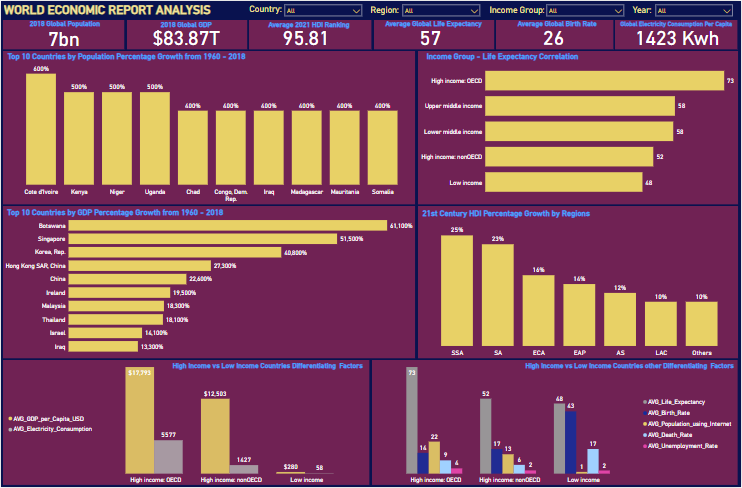

# WORLD ECONOMIC INDICATORS ANALYSIS

---
## Introduction
This project conducts a rigorous exploratory analysis of global economic and development indicators, using SQL for in-depth analysis and Power BI for visualization. It provides a comprehensive evaluation of key metrics driving socio-economic growth and development, following the standards of leading international organizations like the World Bank and United Nations. The goal is to simplify complex data, supporting strategic economic and holistic development policies and decision-making for countries on a global scale.

## Table of Content
- [Project Overview](https://github.com/DannyAlao/WORLD-ECONOMIC-INDICATORS-ANALYSIS-PROJECT/edit/main/README.md#project-overview)
- [Project Scope](https://github.com/DannyAlao/WORLD-ECONOMIC-INDICATORS-ANALYSIS-PROJECT/edit/main/README.md#project-scope)
- [Project Objectives](https://github.com/DannyAlao/WORLD-ECONOMIC-INDICATORS-ANALYSIS-PROJECT/edit/main/README.md#project-objectives)
- [Expected Outcome](https://github.com/DannyAlao/WORLD-ECONOMIC-INDICATORS-ANALYSIS-PROJECT/edit/main/README.md#expected-outcome)
- [Document Purpose](https://github.com/DannyAlao/WORLD-ECONOMIC-INDICATORS-ANALYSIS-PROJECT/edit/main/README.md#document-purpose)
- [Use Case](https://github.com/DannyAlao/WORLD-ECONOMIC-INDICATORS-ANALYSIS-PROJECT/edit/main/README.md#use-case)
- [Skills Demonstrated](https://github.com/DannyAlao/WORLD-ECONOMIC-INDICATORS-ANALYSIS-PROJECT/edit/main/README.md#skills-demonstrated)
- [Data Source](https://github.com/DannyAlao/WORLD-ECONOMIC-INDICATORS-ANALYSIS-PROJECT/edit/main/README.md#data-source)
- [Data Cleaning, Processing and Modification](https://github.com/DannyAlao/WORLD-ECONOMIC-INDICATORS-ANALYSIS-PROJECT/edit/main/README.md#data-cleaning-processing-and-modification)
- [Exploratory Data Analysis - EDA](https://github.com/DannyAlao/WORLD-ECONOMIC-INDICATORS-ANALYSIS-PROJECT/edit/main/README.md#exploratory-data-analysis---eda)
- [Data Analysis and Insight](https://github.com/DannyAlao/WORLD-ECONOMIC-INDICATORS-ANALYSIS-PROJECT/edit/main/README.md#data-analysis-and-insight)
- [Data Visualization](https://github.com/DannyAlao/WORLD-ECONOMIC-INDICATORS-ANALYSIS-PROJECT/edit/main/README.md#data-visualization)
- [Recommendations](https://github.com/DannyAlao/WORLD-ECONOMIC-INDICATORS-ANALYSIS-PROJECT/edit/main/README.md#recommendations)
- [Conclusion](https://github.com/DannyAlao/WORLD-ECONOMIC-INDICATORS-ANALYSIS-PROJECT/edit/main/README.md#conclusion)

## Project Overview
This project offers in-depth, data-driven insights into the economic performance and development status of countries worldwide, using SQL for analysis and Power BI for visualization. Drawing on datasets from the World Bank and UN, it examines key indicators like GDP per capita, life expectancy, and inequality from 1960-2021. The findings aim to guide policymakers in strategically formulating, implementing, and evaluating development policies that align with global standards while addressing unique national contexts, ultimately fostering shared prosperity and better living conditions.

## Project Scope
This project covers a comprehensive analysis of key socioeconomic and development indicators, including electricity consumption, GDP per capita, life expectancy, educational attainment, environmental impact, and inequality. The data, curated by the World Bank (1960-2018) and the United Nations' HDI (1990-2021), highlights significant trends in population and GDP growth, HDI performance, income categorization, and global inequalities. It also explores the likely correlating factors that influence life expectancy across countries.

## Project Objectives
This analysis is guided by the following objectives:
- **Population and GDP Growth Analysis**: Identify countries that have experienced significant growth in both population and GDP over time. Assess the overlap between population and GDP growth and its relation to overall development.
- **Regional HDI Growth in the 21st Century**: Evaluate which regions have demonstrated strong commitment to improving the Human Development Index (HDI), reflecting their policy priorities.
- **Correlation Analysis of Life Expectancy**: Investigate the factors that may correlate with life expectancy globally, providing insights into the variables influencing longevity.
- **Global Development Disparities**: Examine the factors contributing to economic and development disparities between countries, exploring the causes of global development categorization.

By analyzing these objectives, political leaders, government officials, policymakers, and development experts can gain critical insights to formulate and implement more effective strategies for achieving sustainable socioeconomic development.

## Expected Outcome
The analysis aims to provide actionable insights, including:
- Identification of Countries with the Highest Population and GDP Growth: Determine which countries have experienced the most significant increases in population and GDP from 1960 to 2018, highlighting trends and patterns in economic and demographic growth.
- Assessing Overlap in Growth: Analyze the overlap between countries that have seen the highest growth in both population and GDP, identifying any common characteristics or outliers.
- HDI Growth in the 21st Century: Pinpoint regions that have seen the greatest improvement in Human Development Index (HDI) since 2001, identifying factors contributing to this growth.
- Life Expectancy Correlations: Discover the factors most strongly correlated with life expectancy across countries, such as GDP per capita, healthcare access, or education levels.
- Income Group Differentiators: Compare and contrast factors like GDP, life expectancy, and education levels to determine what sets "High Income" countries apart from "Low Income" ones.
- Recommendations for innovative and strategic economic and development policy formulation, implementation, and evaluation to promote sustainable growth across different countries.

## Document Purpose
This documentation will offer political leaders and public officeholders, government officials, policymakers, international development experts, and policy Analysts comprehensive insights into the project's objectives, data sources, analysis, visualizations, and other key information related to economic development indicators.

## Use Case
This analysis of world economic development indicators offers valuable insights and recommendations that can drive both holistic and context-specific socioeconomic development across various regions and countries. Political leaders, governing entities, policymakers, development experts, consultants, and policy analysts can utilize these findings to enhance their contributions to growth-oriented, people-centered economic development. Notably, stakeholders in the regions referenced in this dataset can leverage these insights to design and implement policies that prioritize sustainable, inclusive development. Below are key stakeholders who can use this analysis to support and sustain people-centered development strategies.
1. **Political Leaders**:
   - Use of Analysis: Political leaders, public officeholders, government officials and governance custodians across various countries can leverage these insights to enhance data-driven policy formulation, implementation, and evaluation. This will support people-centered, context-specific development and promote efficient governance for the benefit of their citizens.
   - Benefits: Enhanced and sustained data-driven policy formulation, implementation, and ongoing evaluation will drive socio-economic development and common prosperity. This approach will lead to more effective, context-specific governance and improved development performance rankings for countries.
2. **Development Policy-makers**:
   - Use of Analysis: Development policymakers can leverage this analysis and its insights when tasked with consolidating, formulating, and crafting policies aimed at sustaining comprehensive development. These insights will be particularly valuable in addressing key socioeconomic prosperity indicators as outlined by the World Bank and the UN's Human Development Index (HDI).
   - Benefits: Improved quality of public policy formulation will drive context-specific, holistic socioeconomic development, leading to a better standard of living for the citizens of their respective countries.
3. **Development Experts and Consultants**:
   - Use of Analysis: Development experts can utilize this analysis to provide high-quality, data-driven counsel and refine their expertise in the field of development policy consultancy, particularly for developing countries. Additionally, the insights gained from this analysis can be leveraged to enhance the quality of development research, contributing to strategies aimed at improving a country's development rankings and considering the adoption of new metrics where necessary.
   - Benefits: Enhanced expertise and a deeper body of knowledge in socioeconomic development policy consultancy throughout the policy lifecycle. This includes the ability to offer informed advice on achieving key development metrics through data-driven policy formulation, implementation, and evaluation. Such insights can be adapted or referenced across different contexts and timeframes as needed.
4. **Policy Analysts**:
   - Use of Analysis: Policy analysts will find the insights from this analysis invaluable for deepening their understanding of development policies. This knowledge will help them identify the most suitable policies to drive or sustain socio-economic prosperity and holistic development, tailored to the unique contexts of different countries. Additionally, the analysis highlights key indicators to consider when evaluating development across various nations.
   - Benefits: Enhanced knowledge and resources to support the analysis and comparison of socioeconomic development policies, utilizing current metrics both within a country and globally. This will enable policy analysts to provide data-driven recommendations.

## Skills Demonstrated
This analysis was conducted using a combination of SQL and Power BI to extract, clean, aggregate, and visualize the data, uncovering meaningful insights.
1. **Microsoft SQL Server Management Studio (SSMS)**: Utilized efficient data querying, leveraging both Data Definition Language (DDL) and Data Manipulation Language (DML) for data cleaning and aggregation, preparing the dataset for in-depth analysis.
2. **Microsoft Power BI**: Employed for advanced data visualization, dashboard creation, and interactive reporting. This tool facilitated data visualization to uncover and display meaningful patterns and insights. The following skills were demonstrated throughout the analysis:
- **Data Import**: Utilized Microsoft SQL Server Management Studio (SSMS) for efficient data import and integration.
- **Data Cleaning and Processing**: Performed data cleaning, transformation, and modification in SSMS to ensure data accuracy and readiness for analysis.
- **Data Exploration**: Conducted exploratory data analysis in SSMS to identify trends and relationships within the dataset.
- **Data Analysis**: Applied advanced querying and analytical techniques in SSMS to derive meaningful insights from the data.
- **Data Visualization**: Utilized Microsoft Power BI to develop comprehensive visualizations and interactive dashboards for effective data presentation and reporting.

These tools were utilized to effectively analyze and visualize the economic development performance of countries listed in both the World Bank and UN HDI datasets. The analysis provided valuable insights and actionable recommendations to support the formulation, evaluation, and implementation of comprehensive policies aimed at fostering individual and economic development.

## Data Source
The dataset for this analysis was sourced from [Maven Analytics](https://app.mavenanalytics.io/datasets), a reputable provider of high-quality datasets for business intelligence and data analysis practice. The project utilized two CSV files: the World Bank Economic and Development Report table and the United Nations Human Development Index (HDI) table. 

The World Bank Economic Performance and Development table contains key information on the economic indicators of countries from 1960 to 2018. The World Bank report table has twelve thousand, four hundred and forty-nine (12,449) rows and sixteen (16) columns which are Country-Name, Country-Code, Region, Income-Group, Year, Birth-Rate-Crude-Per-1000-People, Death-Rate-Crude-Per-1000-People, Electricity-Power-Consumption-KWh-Per-Capita, GDP-USD, GDP-Per-Capita-USD, Individuals-Using-the-Internet-of-Population, Infant-Mortality-Rate-Per-1000-Live-Births, Life-Expectancy-at-Birth-Years, Population-Density-People-Per-SQ-KM-of-Land-Area, Unemployment-of-Total-Labour-Modeled-ILO-Estimate, and Population. The World Bank report table includes key attributes as columns pertinent for a comprehensive analysis such as:
- Country Name: The name of the country.
- Country Code: The three-letter code representing the country.
- Region: The World Bank region of the country.
- Income Group: The World Bank Income Group of the country.
- Year: The Year in which the statistics were recorded.
- Birth rate crude (per 1000 people): The Birth rate per 1000 people in the country.
- Death rate crude (per 1000 people): The death rate per 1000 people in the country.
- Electric power consumption (kWh per capita): The electricity consumption per person in kilowatt-hours in the country.
- GDP (USD): The gross domestic product or total economic output of the country.
- GDP per capita (USD): The gross domestic product or economic output per person in the country.
- Individuals using the Internet (% of population): The percentage of individuals using the internet in each country.
- Infant mortality rate (per 1000 live births): The infant mortality rate per 1000 births in the country.
- Life expectancy at birth (years): The life expectancy in years at birth in the country.
- Population density (people per sq. km of land area): The number of people per square kilometer in the country.
- Population: The total number of people in the country.
- Unemployment (% of total labor force modeled ILO estimate): The percentage of the labor force that is not employed. 

Each of these variables provides essential insights, collectively enhancing the analysis of economic development metrics for nations worldwide as reported by the World Bank.

Similarly, the UN Human Development Index (HDI) table contains composite data on the economic development of each country from 1990 to 2021, comprising 206 rows and 1,008 columns. For this analysis, a subset of 37 key columns was extracted into a new table named HDI-Table-Analysis, while retaining the original 206 rows. 
These columns are: Iso3, Country, Hdi_Code, Region, Hdi_Rank_2021, Hdi_1990, Hdi_1991, Hdi_1992, Hdi_1993, Hdi_1994, Hdi_1995, Hdi_1996, Hdi_1997, Hdi_1998, Hdi_1999, Hdi_2000, Hdi_2001, Hdi_2002, Hdi_2003, Hdi_2004, Hdi_2005, Hdi_2006, Hdi_2007, Hdi_2008, Hdi_2009, Hdi_2010, Hdi_2011, Hdi_2012, Hdi_2013, Hdi_2014, Hdi_2015, Hdi_2016, Hdi_2017, Hdi_2018, Hdi_2019, Hdi_2020, and Hdi_2021.

Here are the key variables in each column from the newly extracted United Nations HDI (Human Development Index) report table, named HDI-Table-Analysis. These variables provide significant information for in-depth analysis, including:
- Iso3: The three-letter code representing the country.
- Country: The name of the country.
- Hdi_Code: The Hdi grouping from the UN.
- Region: The UNDP development regions.
- Hdi_Rank_2021: The country's HDI rank in 2021.
- Hdi_1990: The country's HDI in year 1990.
- Hdi_1991: The country's HDI in year 1991.
- Hdi_1992: The country's HDI in year 1992.
- Hdi_1993: The country's HDI in year 1993.
- Hdi_1994: The country's HDI in year 1994.
- Hdi_1995: The country's HDI in year 1995.
- Hdi_1996: The country's HDI in year 1996.
- Hdi_1997: The country's HDI in year 1997.
- Hdi_1998: The country's HDI in year 1998.
- Hdi_1999: The country's HDI in year 1999.
- Hdi_2000: The country's HDI in year 2000.
- Hdi_2001: The country's HDI in year 2001.
- Hdi_2002: The country's HDI in year 2002.
- Hdi_2003: The country's HDI in year 2003.
- Hdi_2004: The country's HDI in year 2004.
- Hdi_2005: The country's HDI in year 2005.
- Hdi_2006: The country's HDI in year 2006.
- Hdi_2007: The country's HDI in year 2007.
- Hdi_2008: The country's HDI in year 2008.
- Hdi_2009: The country's HDI in year 2009.
- Hdi_2010: The country's HDI in year 2010.
- Hdi_2011: The country's HDI in year 2011.
- Hdi_2012: The country's HDI in year 2012.
- Hdi_2013: The country's HDI in year 2013.
- Hdi_2014: The country's HDI in year 2014.
- Hdi_2015: The country's HDI in year 2015.
- Hdi_2016: The country's HDI in year 2016.
- Hdi_2017: The country's HDI in year 2017.
- Hdi_2018: The country's HDI in year 2018.
- Hdi_2019: The country's HDI in year 2019.
- Hdi_2020: The country's HDI in year 2020.
- Hdi_2021: The country's HDI in year 2021.

Each of these variables offers critical insights, collectively enriching the analysis of composite economic development metrics and global statistics related to human development, as reported in the United Nations' Human Development Index.

## Data Cleaning, Processing and Modification
This analysis took steps that involves cleaning, processing and modification of the dataset to ensure its quality and reliability. 
1. **Data cleaning**: Data cleaning helps achieve high data integrity, quality, consistency, and accuracy. This process includes, but is not limited to, four key steps: removing duplicates, standardizing the dataset, checking for null or blank rows, and removing columns deemed irrelevant to the analysis.

In light of the foregoing, it was observed that both tables in the dataset were well-structured, consistent, and free from significant errors or omissions that could impede the analysis and the overall actionable insights generated from the dataset. In strict adherence to the principles of data consistency and accuracy, the following checks were performed: Firstly, checking for duplicates. No duplicate values were found in either the World Bank Report Table or the UN HDI table. In addition, columns in the World Bank table with null or blank values were filled with zero (0). No columns were removed. This process, which involved writing a query in Microsoft SQL Server Management Studio, ensured the dataset followed a standardized format and adhered to consistent naming conventions. In summary, all necessary data fields are present and populated, the data values are accurate, and there are no duplicate records. Below is the SQL query used to replace null or blank with 0 in the World Bank economic development table:

```sql
UPDATE World_Bank
Set GDP_USD = 0
Where GDP_USD IS NUll
```
**Note**: This SQL query was applied to all columns in the World Bank table containing null or blank rows.

2. **Data processing and modification**: Data processing and modification are essential for altering the dataset when necessary to enhance the analysis process and improve the quality of the final outcomes and recommendations. In the context of this analysis, the data processing and modification steps are as follows:
  - Added a new column to the World Bank table: One of the core objectives of this analysis is to determine the growth in population and GDP for each country. The World Bank table includes columns for total GDP, GDP per capita, and population per square meter, but it does not provide the total population. Therefore, a new column was added to the table to determine the population of each country per year. This population column was created using an SQL query.

Below is the SQL query executed to create the yearly population column for each country from 1960 to 2018 in the World Bank Development Report table:

```sql
Alter Table World_Bank
add [Population] int
```

  - Calculated and populated data in the Population column: After creating the population column, it was populated using a calculated query that divides GDP-USD by GDP-per-Capita-USD. Below is the SQL query executed to calculate the total yearly population of each country in the World Bank report table from 1960 to 2018:

```sql
Update World_Bank
Set [Population] = GDP_USD/GDP_per_Capita_USD
```

   - Column names were standardized to consistent casing: Additionally, the columns in the World Bank table were converted to proper case using the sp_rename query in Microsoft SQL Server Management Studio. The SQL query below demonstrates how the column names were modified from inconsistent casing to proper casing:

```sql
Execute sp_rename'World_Bank.IncomeGroup','Income_Group'
```
  - Identified and counted null or blank rows: Furthermore, some columns in the World Bank report table contained null and blanks. To prepare the table for analysis, the number of null and blank rows in each column was counted using an SQL query. Below is the query used to determine the number of rows with null or blank in the World Bank report table:

```sql
Select count([Population]) As Number_0f_Rows_with _Null_in _the_Population_column
from World_Bank
where [Population] IS Null
```

The above process was repeated for the other columns in the World Bank report table to determine the number of rows with null or blank. Below are the results obtained from each query executed to identify the null and blank in the columns of the World Bank report table:
- Population: - Two thousand, eight hundred and seventy-four (2874) rows with null.
- Birth-Rate-Crude-per-1000-People: - One thousand and nine 1009 rows with null.
- Death-Rate-Crude-per-1000-People: - One thousand and thirty-three (1033) rows with null.
- Electric-Power-Consumption-kWh-per-Capita: - Six thousand, six hundred and ninety-seven (6697) rows with null.
- GDP-USD: - Two thousand, eight hundred and seventy-one (2871) rows with null.
- GDP-per-Capita-USD: - Two thousand, eight hundred and seventy-four (2874) rows with null.
- Individuals-using-the-Internet-of-Population: - Seven thousand, seven hundred and sixty-nine (7769) rows with null.
- Infant-Mortality-Rate-per-1000-Live-Births: - Two thousand, four hundred and sixty-five (2465) rows with null.
- Life-Expectancy-at-Birth-Years: - One thousand, two hundred and ninety (1290) rows with null.
- Population-Density-People-per-Sq-Km-of-Land-Area: -Six hundred and sixty-eight (668) rows of null.
- Unemployment-of-Total-Labor-Force-Modeled-ILO-Estimate: - Seven thousand, two hundred and ninety-two (7292) rows with null.

Similarly, the UN Human Development Index (HDI) table, which contains informational statistics on the human development performance of countries worldwide, did not require additional columns or modifications. However, due to the large number of columns in the table, and considering the key information needed for this analysis, a new table was created. This new table, named HDI-Table-Analysis, was populated with thirty-seven (37) key columns from the original UN HDI table, which had over a thousand columns. These columns were assigned the appropriate data types and underwent minor modifications, such as changing the column headings to proper case. The SQL query below is a that demonstrates how column names were modified from inconsistent casing to proper casing in the HDI-Table-Analysis table:
```sql
Execute sp_rename 'HDI_Table_Analysis.iso3', 'Iso3'
```
Here  are the new column names: Iso3, Country, Hdi-Code, Region, Hdi-Rank-2021, Hdi-1990, Hdi-1991, Hdi-1992, Hdi-1993, Hdi-1994, Hdi-1995, Hdi-1996, Hdi-1997, Hdi-1998, Hdi-1999, Hdi-2000, Hdi-2001, Hdi-2002, Hdi-2003, Hdi-2004, Hdi-2005, Hdi-2006, Hdi-2007, Hdi-2008, Hdi-2009, Hdi-2010, Hdi-2011, Hdi-2012, Hdi-2013, Hdi-2014, Hdi-2015, Hdi-2016, Hdi-2017, Hdi-2018, Hdi-2019, Hdi-2020, and Hdi-2021. Rows with null or blank values in the columns were left empty, except for the “Region” column. In the “Region” column, null or blank rows were filled with “Others” due to the unique nature of the information in this column. “Others” refers to United Nations Development Program (UNDP) countries whose regional categorization is either unknown, not clearly defined, or different from the regions listed in the UN HDI report table for the year under review. Below is the SQL query executed to populate null rows in the “Region” column with “Others”:

```sql
Update HDI_Table_Analysis
Set Region = 'Others’
Where 'Region' Is Null
```
## Exploratory Data Analysis - EDA
The exploratory data analysis (EDA) examined both the World Bank Economic Development Report and the United Nations Human Development Index tables to address the following key questions:
- Which countries have experienced the highest growth in population and GDP? Is there overlap?
- Which regions saw the most growth in HDI in the 21st century?
- Which factors are highly correlated with life expectancy?
- Which factors differentiate "High Income" vs "Low Income" Countries?

## Data Analysis and Insight
The core objective of this analysis is to extract valuable insights and provide data-driven recommendations by examining key economic development indicators. Utilizing data from the World Bank's economic-development performance reports (1960-2018) and the United Nations' Human Development Index (HDI) reports (1990-2021), this analysis aims to comprehensively assess the critical factors driving economic growth and development across different countries.

In light of the above, several key objectives have been identified to guide this analysis in generating data-driven insights. First and foremost, the analysis seeks to identify countries that have experienced a significant upward trajectory in both population and GDP, according to the World Bank's reports from 1960-2018, and to explore any potential overlap between these two growth and development metrics. Additionally, the analysis will examine the relationship between population growth and GDP growth, investigating how each influences the other.

Another critical objective is to determine which regions, according to the UN Human Development Index (HDI) reports from 1990-2021, have shown the most significant growth in human development in the 21st century and to assess how this translates into improved socio-economic outcomes across sectors for these countries and their citizens. Of particular importance, the analysis will also explore the factors most strongly correlated with average life expectancy in each country, as reported by the World Bank, to identify determinants of either higher or lower life expectancy.

Finally, this analysis aims to identify the factors that contribute to economic and developmental disparities, income inequality, and gaps between countries, in alignment with the comprehensive metrics established by both the World Bank and the UN. It is against the above backdrop that this analysis provides answers to the following questions:

1. **Which countries have experienced the highest growth in population and GDP? Is there overlap?**
This analysis offers detailed insights into countries with significant growth in both population and GDP over the years, in alignment with the World Bank's composite measures for economic development. The focus is on exploring the relationship between population and GDP growth from 1960 to 2018.

To address this two-part question, a CTE (Common Table Expression) query was executed in Microsoft SQL Server Management Studio. This query calculated the population and GDP growth for each country using data from the World Bank's economic development report. The query compared population figures from 1960 and 2018, calculating the percentage increase for each country. The results were then grouped by country and ordered by percentage growth in descending order, highlighting those countries that have experienced the most significant population growth over time. 

(i) population Growth

An SQL query was written and executed to identify the countries with the highest population growth from 1960 to 2018. The query utilized a GROUP BY clause to calculate the population for each country, and an ORDER BY clause to rank the countries by their population growth in descending order.

```sql
WITH Percentage_Population_Growth AS (
    SELECT 
        Country_Name, Population_1960, Population_2018,
        ((Population_2018 - Population_1960) / Population_1960) * 100 AS Population_Growth_Percentage
    FROM (
        SELECT 
            [Country_Name], Nullif(MIN(CASE WHEN [Year] = 1960 THEN [Population] END),0) AS Population_1960,
            MAX(CASE WHEN [Year] = 2018 THEN [Population] END) AS Population_2018
    FROM 
            World_Bank
        GROUP BY 
            Country_Name
    ) AS SubqueryAlias
)
SELECT Top 10
    [Country_Name], Population_1960, Population_2018,
	CONCAT(CAST(Population_Growth_Percentage AS VARCHAR(10)), '%') AS Population_Growth
FROM 
    Percentage_Population_Growth
ORDER BY Population_Growth_Percentage DESC
```

The SQL query result table lists the top 10 countries with the highest population growth from 1960 to 2018.

 SN | Country_Name | Population_1960 | Population_2018 | Population_Growth 
:---:|:------------:|:---------------:|:---------------:|:-----------------:
1 | Cote d'Ivoire | 3503553 | 25069220 | 600%
2 | Uganda | 6767088 | 42723045 | 500%
3 | Niger | 3388769 | 22442936 | 500%
4 | Kenya | 8120077 | 51393036 | 500%
5 | Iraq | 7289742 | 38448189 | 400%
6 | Mauritania | 850382 | 4403307 | 400%
7 | Chad | 3001598 | 15477682 | 400%
8 | Madagascar | 5099376 | 26262445 | 400%
9 | Somalia | 2755972 | 15008169 | 400%
10 | Congo, Dem. Rep. | 15248236 | 84068056 | 400%

The result table was integrated with Power BI to create a column chart visualization. 

_The column chart visually represents and analyzes the percentage population growth of the top 10 countries from 1960 to 2018_


(ii) GDP Growth

Similarly, a SQL CTE query was executed to calculate the GDP (Gross Domestic Product) growth from 1960 to 2018 for each country. The percentage increase in GDP was determined by comparing the GDP in 1960 with that of 2018. The GROUP BY function was used to aggregate GDP data for each country, and an ORDER BY clause was applied to rank the countries by GDP growth in descending order.

_The SQL query written and executed to calculate the countries with the highest Gross Domestic Product (GDP) growth from 1960 to 2018_
```sql
WITH Percentage_GDP_Growth AS (
    SELECT 
        Country_Name, GDP_1960, GDP_2018,
        ((GDP_2018 - GDP_1960) / GDP_1960) * 100 AS GDP_Growth_Percentage
    FROM (
        SELECT 
            [Country_Name], 
            Nullif(MIN(CASE WHEN [Year] = 1960 THEN GDP_USD END),0) AS GDP_1960,
            MAX(CASE WHEN [Year] = 2018 THEN GDP_USD END) AS GDP_2018
        FROM 
            World_Bank
        GROUP BY 
            Country_Name
    ) AS SubqueryAlias
)
SELECT Top 10
    [Country_Name],
    GDP_1960, GDP_2018,CONCAT(CAST(GDP_Growth_Percentage AS VARCHAR(10)), '%') AS GDP_Growth
FROM 
    Percentage_GDP_Growth
ORDER BY GDP_Growth_Percentage DESC
```

The table generated from the SQL query lists the top 10 countries with the highest GDP growth from 1960 to 2018
 SN | Country_Name |  GDP_1960  |  GDP_2018  |  GDP_Growth 
:---:|:------------:|:---------------:|:---------------:|:-----------------:
1  | Botswana  |  30412300  |  18616000512  |  61100%
2  | Singapore |  704755968 |  363999985664 |  51500%
3  | Korea, Rep. | 3957240064 | 1619999981568 | 40800%
4  | Hong Kong SAR, China | 1320800000 | 363000004608 | 27300%
5  | China | 59716501504 | 13600000311296 | 22600%
6  | Ireland | 1939330048 | 382000005120  | 19500%
7  | Malaysia | 1916240000 | 354000011264 | 18300%
8  | Thailand | 2760750080 | 505000001536 | 18100%
9  | Israel  | 2598500096  | 370000003072 | 14100%
10 | Iraq | 1684120064  |  225999994880  | 13300%

The result table was integrated into Power BI to create a column chart visualization. 

_The bar chart graphically represents and analyzes the percentage growth in Gross Domestic Product (GDP) for the top 10 countries from 1960 to 2018_


- The analysis reveals that the top countries experiencing a significant population increase of over 100% from 1960 to 2018, in descending order, are: Côte d’Ivoire, Uganda, Niger, Kenya, Iraq, Mauritania, Chad, Madagascar, Somalia, and the Democratic Republic of the Congo. This substantial growth may be attributed to improvements in quality of life and living conditions, which have positively impacted reproductive health and fertility rates.
- Countries such as Botswana, Singapore, South Korea, Hong Kong SAR, China, Ireland, Malaysia, Thailand, Israel, and Iraq experienced significant GDP growth from 1960 to 2018. This remarkable economic expansion can be attributed to effective economic and development policies, good governance, and the creation of an enabling environment for economic activities to flourish. These factors collectively indicate a robust and economically viable population.
- Iraq experienced proportional growth in both population and GDP from 1960 to 2018, thus ranking among the top countries examined in this regard. This indicates the implementation of effective, people-centered economic and development policies by political leaders and socioeconomic policymakers.

2. **Overlap between population and GDP growth for countries from 1960-2018**
Following the initial analysis, the second part of this question utilized SQL to calculate the overlap between population growth and GDP growth over the years for each country. The query was streamlined to identify the top-ranked countries with significant proportional growth in both population and GDP. Additionally, it aimed to assess the potential impact of population increases on GDP growth over the years, and vice versa.

To identify the overlap between population and GDP growth, an SQL query was written and executed to determine the top 10 countries where population increases have resulted in commensurate GDP growth.

_An SQL query written and executed to calculate the overlap between population and GDP growth from 1960 to 2018 for countries listed in the World Bank economic development report table_
```sql
WITH combine_Growth AS (
    SELECT 
        Country_Name, Population_1960, Population_2018, GDP_1960, GDP_2018,
        ((Population_2018 - Population_1960) / Population_1960) * 100 AS Population_Growth_Percentage,
        ((GDP_2018 - GDP_1960) / GDP_1960) * 100 AS GDP_Growth_Percentage
    FROM (
        SELECT [Country_Name], 
             Nullif(MIN(CASE WHEN [Year] = 1960 THEN [Population] END),0) AS Population_1960,
            MAX(CASE WHEN [Year] = 2018 THEN [Population] END) AS Population_2018, 
             Nullif(MIN(CASE WHEN [Year] = 1960 THEN GDP_USD END),0) AS GDP_1960,
            MAX(CASE WHEN [Year] = 2018 THEN GDP_USD END) AS GDP_2018
        FROM 
            World_Bank
        GROUP BY 
            Country_Name
    ) AS SubqueryAlias
),Top_Population_Growth AS (
    SELECT Country_Name, Population_1960, Population_2018, Population_Growth_Percentage
    FROM combine_Growth
), Top_GDP_Growth AS (
    SELECT Country_Name, GDP_1960, GDP_2018, GDP_Growth_Percentage
    FROM combine_Growth
) SELECT Top 10
    P.Country_Name AS Country_With_Significant_Overlap,Population_1960, Population_2018, 
	CONCAT(CAST(Population_Growth_Percentage AS VARCHAR(10)), '%') AS Population_Growth,
	GDP_1960, GDP_2018, CONCAT(CAST(GDP_Growth_Percentage AS VARCHAR(10)), '%') AS GDP_Growth 
FROM Top_Population_Growth P
INNER JOIN 
    Top_GDP_Growth G ON P.Country_Name = G.Country_Name
ORDER BY Population_Growth_Percentage DESC, GDP_Growth_Percentage DESC
```

The result table from the SQL query identifies the top 10 countries with significant overlap between population and GDP growth from 1960 to 2018.
 
SN | Country_with_Significant_Overlap|Population_1960|Population_2018|Population_Growth|GDP_1960|GDP_2018| GDP_Growth 
:------:|:-------------------:|:---------------:|:----------------:|:---------:|:-----------:| :-----------:|:-----------:
1 | Cote d'Ivoire | 3503553 | 25069220 | 600% | 546204032 | 43007000576 | 7700%
2 | Kenya | 8120077 | 51393036 | 500% | 791265024 | 87908302848 | 11000%
3 | Uganda | 6767088 | 42723045 | 500% | 423008000 | 27476899840 | 6300%
4 | Niger  | 3388769 | 22442936 | 500% | 449527008 | 9239510016  | 1900%
5 | Iraq  | 7289742 | 38448189 | 400% | 1684120064 | 225999994880 | 13300%
6 | Congo, Rep. | 1018257 | 5244369 | 400% | 131732000 | 11263699968 | 8400%
7 | Mauritania  | 850382  | 4403307 | 400% | 92609200  | 5365870080  | 5600%
8 | Zambia | 3070774 | 17351840 | 400% | 713000000 | 26720100352 | 3600%
9 | Chad | 3001598 | 15477682 | 400% | 313583008 | 11302500352 | 3500%
10| Somalia | 2755972 | 15008169 | 400% | 180460000 | 4720999936 | 2500%

- The analysis revealed that Côte d’Ivoire, Kenya, Uganda, Niger, Iraq, the Republic of Congo, Mauritania, Zambia, Chad, and Somalia demonstrated a strong overlap between population and GDP percentage growth from 1960 to 2018.
- Kenya and Iraq exhibited substantial population growth, which correspondingly led to significant increases in GDP from 1960 to 2018.
- Furthermore, some countries exhibited relatively lower percentage growth in population compared to GDP, indicating that their GDP growth significantly outpaced their population growth. These countries, which are political and economic superpowers, are primarily located in Oceania, Asia, and Western Europe.

3. **Which regions saw the most growth in HDI in the 21st century?**

The objective of this analysis was to determine which regions, as defined by the United Nations, have achieved top rankings in terms of HDI from 2001 to 2021. In other words, it aimed to evaluate how well countries in these regions have formulated and implemented development policies to achieve these metrics and foster human capital development during the period under review.

An in-depth analysis was conducted on the composite measures of development, including life expectancy, GDP per capita, educational attainment, environmental impact, and inequality for each country from 1990 to 2021. These measures, referred to by the United Nations as the Human Development Index (HDI), assess the level of development of a country. The analysis categorized countries into different United Nations Development Programme regions: Sub-Saharan Africa (SSA), South Asia (SA), Europe and Central Asia (ECA), East Asia and the Pacific (EAP), Arab States (AS), and "Others".

To determine the HDI growth performance of countries grouped by these regions in the 21st century (2001-2021), an SQL query was written and executed to calculate regional growth performance based on the data available in the UN HDI table.

Below is the SQL query written and executed to determine the HDI growth of regions in the 21st century.
```sql
SELECT Region, CONCAT(CAST(ROUND((SUM(ISNULL(Hdi_2021, 0)) - SUM(ISNULL(Hdi_2001, 0))) 
/ SUM(ISNULL(Hdi_2001, 0)) * 100, 0) AS VARCHAR(10)),'%') 
AS Hdi_Growth_Percentage_In_21st_Century
FROM 
   HDI_Table_Analysis
WHERE 
    Hdi_2021 IS NOT NULL AND Hdi_2001 IS NOT NULL  
GROUP BY 
    Region
ORDER BY ROUND((SUM(ISNULL(Hdi_2021, 0)) - SUM(ISNULL(Hdi_2001, 0))) 
/ SUM(ISNULL(Hdi_2001, 0)) * 100, 0) DESC
```

The result table from the SQL query identifies the region with the highest human development index growth in the 21st century - 2001 to 2021. 

Region |  Hdi_Growth_Percentage_In_21st_Century
:-----:|:--------------------------------------:
SSA | 25%
SA  | 23%
ECA | 16%
EAP | 14%
AS  | 12%
LAC | 10%
Others | 10%

The result table was used in conjunction with a visualization tool in Power BI.

_The column chart graphically represents and analyzes the regions with the highest HDI percentage growth in the 21st century_


- According to this analysis, the Sub-Saharan Africa (SSA) region, with an approximate 25% increase, has the highest Human Development Index (HDI) growth in the 21st century. This growth is likely linked to policy efforts and political leadership that support fulfilling the composite metrics for holistic development, as tracked by the UN. The region has made significant strides in developing its human capital during the period under review.
- The South Asia (SA) region came second with approximately 23% increase in Human Development Index (HDI) growth in the 21st century. This indicates that the region is actively making and implementing policies that support the development and growth of its inhabitants, in line with the UN’s composite metrics for human development through effective governance and appropriate policy formulation and implementation.
- The Europe and Central Asia (ECA) region experienced a 16% growth in the Human Development Index (HDI) from 2001 to 2021, compared to the Sub-Saharan Africa (SSA) and South Asia (SA) regions. This growth reflects the existing policies, structures, and investments that have facilitated the development of the region’s inhabitants in the 21st century.
- The East Asia and the Pacific (EAP) region, with a 14% increase, had the fourth highest HDI growth in the 21st century. This growth percentage is closely linked to the availability of composite metrics clearly stipulated by the UN to measure human capital development across different regions.
- The Arab States (AS), Latin America and the Caribbean (LAC), and other regions not categorized by the UN experienced HDI growth of 12%, 10%, and 10% respectively in the 21st century. This relatively lower growth might be attributed to insufficient efforts to improve human capital or a lack of commitment to enhancing existing approaches to human development in recent times.

Understanding the growth percentage of the Human Development Index (HDI) for regions allows for predictive and diagnostic measures to improve and consolidate human capital development efforts, as categorized by the United Nations Development Programme (UNDP). This performance indicates potential sustainability for top-ranked regions and provides a viable opportunity for improvement in regions with lower performance.

4	**Which factors are highly correlated with life expectancy**?

This analysis explores the relationship between key factors and life expectancy for citizens of countries listed in the World Bank's Economic Development Indicators report from 1960 to 2018, aiming to identify the primary determinants of life expectancy. Life expectancy is an estimate of the average age at which people will die, essentially indicating how long an individual is expected to live. 

Several variables influence life expectancy, including health behaviors, socioeconomic background, healthcare access, and the social/physical environment. The World Bank considers the longevity of citizens as a crucial economic and development metric, reflecting a country’s development and socio-economic prosperity. This analysis examines these variables in the context of the World Bank’s economic and development statistics to understand their impact on life expectancy.

For this analysis, an SQL query was written and executed to calculate the correlation coefficient, which quantifies the strength and direction of the relationship between life expectancy and GDP per capita. The correlation coefficient is a widely used statistical measure that helps understand the degree of linear association between two variables. It was adopted in this analysis to determine the relationship between life expectancy and GDP per capita

Below is the SQL CTE (Common Table Expression) query written and executed to determine the correlation between GDP per Capita and life expectancy.
```sql
WITH Correlating_Factor AS (
    SELECT 
        AVG(Life_Expectancy_at_Birth_Years) AS avg_life_expectancy,
        AVG(GDP_per_Capita_USD) AS avg_GDP_Per_Capita,
        STDEV(Life_Expectancy_at_Birth_Years) AS stddev_life_expectancy,
        STDEV(GDP_per_Capita_USD) AS stddev_GDP_Per_Capita
    FROM 
        World_Bank
),
Covariance AS (
    SELECT 
       AVG((Life_Expectancy_at_Birth_Years - S.avg_life_expectancy) 
	   * (GDP_per_Capita_USD - S.avg_GDP_Per_Capita)) AS covariance
    FROM 
        World_Bank, Correlating_Factor S
)
SELECT 
    Round(C.covariance / (S.stddev_life_expectancy * S.stddev_GDP_Per_Capita), 2) 
	AS Correlation_Coefficient
FROM 
    Covariance C, Correlating_Factor S
```

The SQL CTE query result shows the correlation between life expectancy and GDP per Capita in each country, based on World Bank economic development metrics.

Correlation Coefficient
:---------------------:
0.12

The first query calculates the correlation coefficient by first determining the averages and standard deviations, then computing the covariance, and finally, the correlation coefficient. Here are the steps taken using the SQL query to calculate the correlation between life expectancy and GDP per capita:
- **Correlating Factor CTE**: Calculates the averages and standard deviations of life expectancy and GDP per Capita separately first.
- **Covariance CTE**: Uses the results from the correlating factor CTE to calculate the covariance without directly nesting aggregates.
- **Final Query**: Combines these CTE results to calculate the correlation coefficient. The final result returned a correlation coefficient of 0.115090760099905, rounded to 0.12.

**NOTE: Correlation Rules**
- **Positive Correlation**: Factors with a correlation coefficient close to 1 have a strong positive correlation, indicating a high degree of positive relationship between the variables.
- **Negative Correlation**: Factors with a correlation coefficient close to -1 are highly negatively correlated.
- **No Correlation**: A coefficient close to 0 indicates no correlation.

Key insights from the correlation analysis between life expectancy and GDP per capita are as follows:
- From this analysis, and considering the correlation coefficient rules, it is evident that GDP per Capita has a correlative relationship with life expectancy, with a correlation coefficient of 0.115090760099905, rounded to 0.12. This indicates a positive relationship between life expectancy and GDP per Capita. Although the relationship is not very strong, there is a clear indication of an existing positive correlation.
- This analysis further demonstrates that the income level of an average citizen, as a subset of a country’s overall economic performance, can influence their life expectancy.
- As revealed by this analysis, a higher GDP per Capita generally leads to a longer life expectancy for the average citizen. It ensures a stable and secure livelihood, translating into a better quality of life over time with minimal socio-economic challenges.

In addition, other factors correlating with life expectancy include the income group each country belongs to, according to the World Bank categorization. To determine these factors beyond GDP per Capita, an SQL query was written and executed to calculate the average life expectancy of citizens grouped by income level. The World Bank categorizes countries into five income groups: High income (OECD), Upper middle income, Lower middle income, High income (non-OECD), and Low income. This analysis examines the average life expectancy of citizens from countries within each income group as categorized by the World Bank development report.

**Note**: According to the World Bank, OECD stands for the Organization for Economic Co-operation and Development.

Below is the SQL query written to calculate the correlation between life expectancy and the income group categorization of countries.
```sql
SELECT 
    Income_Group,
    Round(AVG(Life_Expectancy_at_Birth_Years),0) AS Avg_Life_Expectancy
FROM 
    World_Bank
GROUP BY 
    Income_Group
ORDER BY 
    Avg_Life_Expectancy DESC
```

The result table obtained from the SQL query written to calculate the correlation between life expectancy and the income group categorization of countries.

Income Group | Average Life Expectancy
:-----------:|:----------------------:
High income: OECD | 73
Upper middle income | 58
Lower middle income | 58
High income: nonOECD | 52
Low income | 48

The result table was utilized in conjunction with a visualization tool in Power BI. 

_Bar Chart to Visualize the Correlation Between Life Expectancy and Income Group Categorization of Countries_


- From this analysis, the income group categorization of countries is a strong determinant of the quality of life that citizens have access to.
- Furthermore, this analysis shows that countries categorized as High income: OECD have an average life expectancy of 73 years; Upper middle income, 58 years; Lower middle income, 58 years; High income: non-OECD, 52 years; and Low income, 48 years. This indicates that citizens in High income: OECD countries tend to have a longer lifespan compared to those in Upper middle income, Lower middle income, High income: non-OECD, and Low-income countries. This suggests that better economic conditions and access to essential amenities significantly contribute to the lifespan of citizens.
- The analysis shows that countries categorized as low income have a relatively lower life expectancy for their citizens, with an average life expectancy of 48 years. This indicates a shorter lifespan due to the lack of basic necessities and the presence of factors such as poverty, corruption, insecurity, and poor governance. Reforms in socio-economic policies and governance can help enhance the lifespan of citizens.
- Middle-income countries, both upper middle and lower middle, demonstrated the same average life expectancy for their citizens, which is 58 years. This reflects the level of economic development and growth in these countries and its impact on citizens’ access to basic necessities for survival. Implementing better economic and development policies could improve the life spans of citizens in these countries.

5. **Which factors differentiate "High Income" vs "Low Income" Countries?**
The aim of this analysis is to identify the factors contributing to economic disparities between countries. High-income and low-income countries exhibit significant differences in economic development and growth. This disparity is evident in the developmental class, quality of political leadership, living conditions, and access to basic necessities.

The analysis considers factors such as GDP per Capita, life expectancy, birth rate, electricity consumption, and internet usage, which are key indicators in the World Bank report. It is important to note that high-income countries are categorized into two groups: High Income (non-OECD) and High Income (OECD).

To identify and analyze the distinctive factors in line with the World Bank’s economic and development indicators report, a SQL query was written to calculate the key factors that differentiate high-income from low-income countries. Below is the SQL query used to determine these differentiating factors.

SQL query written and executed to calculate and determine the factors that differentiate high-income from low-income countries.
```sql
SELECT
    Income_Group,
    CONCAT('$ ', CAST(ROUND(AVG(GDP_per_Capita_USD), 0) AS VARCHAR(10))) AS Avg_GDP_per_Capita,
    ROUND(AVG(Life_Expectancy_at_Birth_Years), 0) AS Avg_Life_Expectancy,
    ROUND(AVG(Birth_Rate_Crude_per_1000_People), 0) AS Avg_Birth_Rate,
    ROUND(AVG(Death_Rate_Crude_per_1000_People), 0) AS Avg_Death_Rate,
    CONCAT(CAST(ROUND(AVG(Electric_Power_Consumption_kWh_per_Capita), 0) AS VARCHAR(10)), ' Kwh') 
	AS Avg_Electric_Power_Consumption,
    ROUND(AVG(Unemployment_of_Total_Labor_Force_Modeled_ILO_Estimate), 0) AS Avg_Unemployment,
    ROUND(AVG(Individuals_using_the_Internet_of_Population), 0) AS Avg_Internet_Consumption
FROM 
    World_Bank
WHERE 
    Income_Group IN ('High income: OECD', 'High income: nonOECD', 'Low income')
GROUP BY 
    Income_Group
ORDER BY 
	Avg_Life_Expectancy DESC, Avg_GDP_per_Capita DESC
```

The result table obtained from the SQL query written and executed to calculate and determine the factors that differentiate high-income from low-income countries.

Income_Group|Avg_GDP_per_Capita|Avg_Life_Expectancy|Avg_Birth_Rate|Avg_Death_Rate|Avg_Electric_Power_Consumption|Avg_Unemployment|Avg_Internet_Consumption
:-----------------:|:----------------:|:-----------------:|:------------:|:---------------:|:----------:|:---------:|:----------:
High income: OECD | $ 17793 | 73 | 14 | 9 | 5577 Kwh | 4 | 22
High income: nonOECD | $ 12503 | 52 | 17 | 6 | 1427 Kwh | 2 | 13
Low income | $ 280 | 48 | 43 | 17 | 58 Kwh | 2 | 1 

The result table was utilized in conjunction with a visualization tool in Power BI. Clustered column charts in Power BI were utilized to illustrate the factors differentiating high-income from low-income countries, based on the World Bank economic development indicators.

_Clustered Column Chart to Display Average GDP per Capita and Average Electricity Consumption per kWh_


_Clustered Column Chart to Display Average Life Expectancy, Average Birth Rate, Average Population Internet Usage, Average Death Rate, and Average Unemployment of the Labour Force_


- The analysis indicates that countries in the high-income OECD group exhibit several positive economic and social development indicators. These countries have a high average GDP per capita, higher average life expectancy, lower average infant mortality, lower average birth rate per 1,000 people, and a relatively lower average death rate per 1,000 people. Additionally, they show higher average electricity consumption. For example, the average GDP per capita is $17,793, the average electricity consumption is 5,577 kWh, and the average life expectancy is 73 years. These metrics strongly suggest better economic growth and development.

However, these countries also experience higher average unemployment rates compared to high-income non-OECD countries and low-income countries. This could indicate a high labor turnover rate, which should be addressed deliberately for improvement.

- High-income non-OECD countries were next in line when comparing high-income and low-income countries. The analysis revealed that these countries had a better average GDP per capita of $12,503, an average life expectancy of 52 years, low average infant mortality, and high average electricity consumption of 1,427 kWh. Additionally, they had a relatively lower average unemployment rate. These factors clearly suggest good socio-economic development and performance.
- The analysis shows that low-income countries have poorer indicators such as lower average GDP per capita, lower average life expectancy, higher infant mortality, higher average birth rate, lower average electricity consumption, and lower average unemployment compared to high-income countries. This suggests that low-income countries have inadequate policies and basic amenities to improve GDP per capita, life expectancy, healthcare facilities, and infant mortality rates, as well as to manage high birth and death rates. Additionally, it is important to note from this analysis that low-income countries are poorer, often poorly governed, and have ineffective economic and development policies compared to high-income countries.

In summary, this analysis highlights that high-income countries are distinctly differentiated from low-income countries by numerous factors, including development, socio-economic conditions, governance, and the formulation and implementation of policies.

## Data Visualization
This visualization dashboard was created using Microsoft Power BI, leveraging DAX code measures for calculations where necessary. It incorporates various visualization tools such as cards, slicers, column charts, clustered column charts, and bar charts to provide a comprehensive overview of global economic indicators. The dashboard offers insights into economic health, growth, and disparities across different regions and income groups. Each visual representation addresses specific questions relevant to the project objectives, facilitating a deeper understanding of the dataset and aligning closely with the project’s goals.



## Recommendations
In line with its guiding objectives, this analysis has produced the following data-driven and insightful recommendations.

1.	**Countries with the highest growth in population and GDP**
- From 1960 to 2018, most countries exhibited a strong arithmetic increase in population and GDP, according to the World Bank Development Indicators report. Identifying and leveraging the policies that contributed to these increases in both population and economic growth should be prioritized.
- Political leaders, government officials, development advisors, and experts can enhance policy formulation, implementation, and evaluation to ensure that population growth remains manageable. By doing so, they can better distribute and utilize both material and immaterial resources, ultimately improving the quality of life for all citizens and inhabitants.
- Socio-economic mechanisms for the continuous well-being of inhabitants and citizens must be at the forefront of sustainable development policy formulation and implementation.
- Moreover, strong and context-specific economic policies to promote trade and investment should be continuously prioritized. This will foster a comprehensive, thriving, and growth-driven economy with a direct positive impact on the well-being of citizens.

2. **Overlap between Population and GDP Growth over time**
- Development policymakers, political leaders, and governance custodians can leverage the country’s population strength to create holistic policies that enhance economic sustainability and growth. This approach would promote a more production-based and less consumption-based economic structure, significantly contributing to GDP and improving GDP per capita.
- Institutions of governance and policymakers should develop sustainable policies to leverage this interconnection, fostering a productive population and a prosperous economy.

3. **Regions with the Most HDI Growth in the 21st Century**
- The progress in the Human Development Index (HDI) since the beginning of this century should be sustained across the seven regions through the formulation and implementation of consolidated human capital development policies.
- Political will from leadership should drive the establishment and consolidation of governance institutions that enable sustainable human development. This can be achieved through strong socio-economic policies that promote the prosperity of citizens, supported by robust development metrics.
- Regions with low or insignificant growth should review their development policies through consultation with development experts and international development agencies such as the World Bank and the UN. This will help identify areas for improvement in policy formulation and implementation, enhancing HDI growth in the foreseeable future.
- Custodians of governance, development advisors, and policy functionaries in the lowly ranked regions on the UN HDI report should adopt and develop context-specific policies and mechanisms to achieve sustainable improvements in future Human Development Index rankings.

4. **Factors Highly correlating with life expectancy**
- Strong economic policies should support entrepreneurial engagement and small and medium-sized businesses through the provision of loans and grants. This will sustain an economy that fosters socioeconomic growth, leading to a better economy, improved growth for citizens, and a higher GDP per capita.
- A data-driven commitment to meticulously formulated and implemented policies should be made to drive a sustainable social safety net for citizens. This deliberate approach will translate into longer life spans, as their socio-economic needs will be continuously met.
- Political leadership and custodians of governance in low-income countries should consult development experts and advisors from various economic sectors to develop socioeconomic and development policies. This will enhance the life expectancy and overall well-being of their citizens.
- Policies that have proven effective in high-income countries with higher GDP per capita and life expectancy should be adapted with context-specific adjustments to improve the standard of living for the average citizen in low-income countries. This approach will help place these countries on a development pedestal.
- International development organizations like the UN and the World Bank should encourage collaboration between low-income and high-income countries to bridge the development gap. By facilitating agencies and providing financial aid and grants, these organizations can promote sustainable economic growth and development, ultimately enhancing and improving the average life spans of citizens in low-income countries.

5. **Factors differentiating "High Income" vs "Low Income" Countries**
- High-income countries, both within and outside the OECD, can sustain their development and growth by implementing policies that enhance the quality of life for their citizens. These policies should focus on the continuous provision of essential social amenities and infrastructure.
- Low-income countries should identify and address the factors and metrics where they are underperforming in development. Additionally, they should collaborate with high-income countries to develop policies that improve the quality of life and enhance the socioeconomic prosperity of their citizens.
- The World Bank and the UN could play an interventionist role by providing expert advice through development consultants and advisors, as well as both financial and non-financial aid to the leadership of countries in this category. This would significantly help to reduce the growth gap between high-income and low-income countries.

## Conclusion
The analysis of global economic indicators provides comprehensive, data-driven insights into the growth and development trajectories of nations worldwide. By examining key metrics such as population trends, GDP performance, human capital development, life expectancy, and access to essential social services, this analysis offers critical information for government officials, policymakers, and development experts. These insights can inform the design, implementation, and evaluation of policies aimed at fostering sustainable socioeconomic progress. By aligning with international standards set by organizations like the United Nations and the World Bank, stakeholders can promote evidence-based policymaking and strategic decision-making to support sustainable development globally.

THANK YOU FOR READING THROUGH! 😃

For comments and observation, you can reach me via alaomoradeyod@gmail.com or [LinkedIn](www.linkedin.com/in/daniel-alao)
